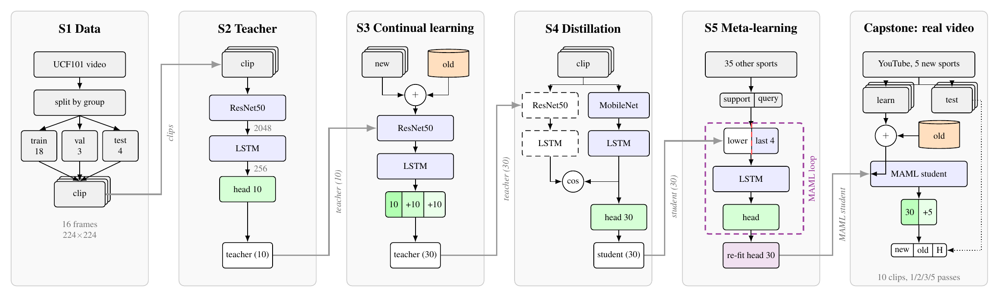
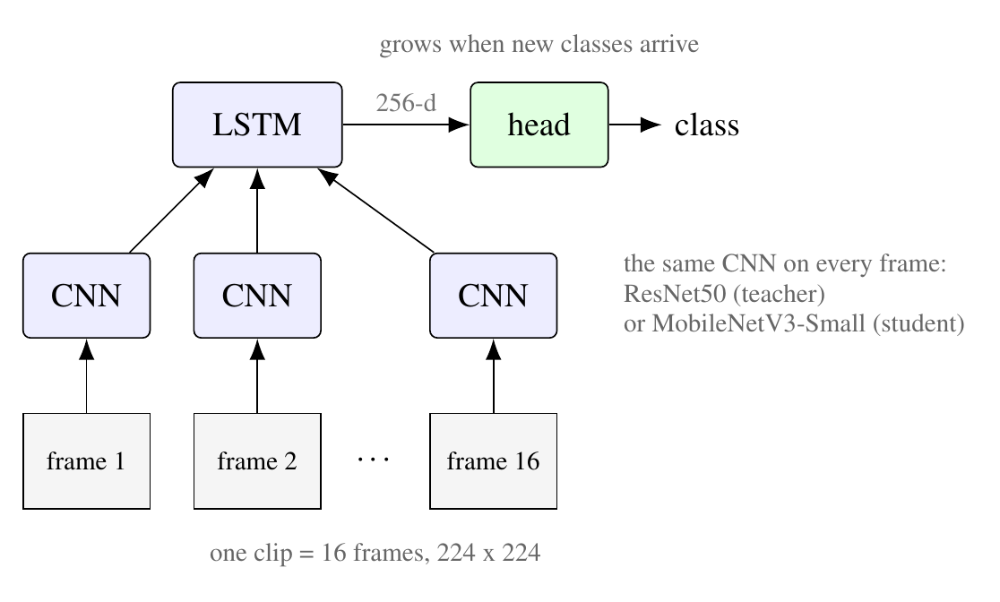

# Unified Lifelong Action Learning (ULAL)

ULAL is a video model that recognises human actions (UCF101) and keeps learning over time.
Everything is trained on real video frames and runs on a free Google Colab GPU.

**Contents**

1. [What the project does](#1-what-the-project-does)
2. [Architecture](#2-architecture): [the pipeline](#21-the-pipeline), [the model](#22-the-model)
3. [Project structure](#3-project-structure)
4. [How to run](#4-how-to-run): [run a notebook](#41-run-a-notebook), [order of the notebooks](#42-order-of-the-notebooks), [tips](#43-tips)

## 1. What the project does

- It learns **new actions without forgetting** the ones it already knows.
- It is **compressed** into a small model that can run on a modest device.
- The small model can learn a **new action from only a few clips**; this is tested on real
  YouTube videos.

The work is split into studies. Each study compares several methods in its own notebook,
and the best method of each study is then used in the full pipeline (`ULAL.ipynb`).

## 2. Architecture

### 2.1 The pipeline



Read the figure from left to right. Each column is one stage; the grey arrows show what a
stage passes to the next one.

1. **S1 Data.** UCF101 clips are cut from longer recordings (groups). We split by whole
   recording (18 train, 3 val, 4 test groups per class), so a test clip never comes from a
   video the model has seen in training. A clip is 16 frames of 224 x 224.
2. **S2 Teacher.** A ResNet50 + LSTM learns the first 10 action classes.
3. **S3 Continual learning.** The teacher learns 10 new classes, and then 10 more (10 -> 20
   -> 30). A small buffer of old clips (orange) is mixed into every batch (replay), so the
   old classes are not forgotten.
4. **S4 Distillation.** The big teacher (dashed = frozen) teaches a small MobileNet student:
   the student learns the classes and points its clip feature in the same direction as the
   teacher's (cosine).
5. **S5 Meta-learning.** The student practises learning new sports from a few clips (MAML)
   on 35 other sports. Only its last 4 blocks, the LSTM and the head are trained (red line =
   freeze boundary). Then its 30-class head is re-fitted.
6. **Capstone: real video.** The student learns 5 sports it has never seen from 10 YouTube
   clips each, together with stored old clips, and is tested on other YouTube videos of
   those sports.

Colours: grey = data, blue = trained, dashed = frozen, orange = stored old clips,
green = classifier head, violet = meta-learning.

### 2.2 The model

<p align="center"></p>

Every stage uses the same design, a **CNN + LSTM** recogniser. It works in four steps:

1. **Input.** A clip of 16 frames (224 x 224 colour images) taken from one video.
2. **CNN, frame by frame.** The same CNN looks at every frame and turns it into a feature
   vector: it describes *what is in the frame* (people, objects, the scene).
3. **LSTM, over time.** The LSTM reads the 16 frame features in order and summarises *how
   things move* into one 256-d clip feature.
4. **Head.** A linear layer turns the clip feature into one score per class; the highest
   score is the predicted action.

**Teacher and student.** Both have the same LSTM and head; only the CNN changes. The teacher
uses ResNet50 (25.9M parameters), the student MobileNetV3-Small (1.8M parameters, 14x
smaller). Because both produce a 256-d clip feature, the student can learn to copy the
teacher's feature directly (distillation).

**A head that grows.** When new classes arrive, new rows are added to the head and the old
rows are kept, so the same model goes from 10 to 20 to 30 classes.

**What is trained in each stage.**

- S2 teacher: the last ResNet50 block, the LSTM and the head (the rest keeps its ImageNet weights).
- S3 continual learning: the whole teacher.
- S4 distillation: the whole student; the teacher is frozen.
- S5 meta-learning: the last 4 blocks of the student, the LSTM and the head.

## 3. Project structure

Notebooks contain no functions: they only call the code in `src/`. When a notebook starts,
it clones the repository from GitHub, runs `bootstrap.py` (mounts Google Drive and downloads
UCF101) and `imports.py` (loads the settings and every module). Clips are written to the
Colab disk; trained models and results are saved on Google Drive.

```
Unified-Lifelong-Action-Learning/
|
|-- README.md
|
|-- notebooks/
|   |-- ULAL.ipynb                        the full pipeline, Parts 1-5
|   `-- study/
|       |-- 1_dataset/
|       |   `-- dataset_study.ipynb       leakage of the shipped split, group-disjoint split
|       |-- 2_choose_model/
|       |   |-- backbone_transfer.ipynb   compares 5 backbones, saves the ResNet50 teacher
|       |   `-- Fine_tune_ViT.ipynb       ViT-B/16 + LSTM on the same split, compared with the CNNs
|       |-- 3_continual_learning/
|       |   |-- naive.ipynb               plain fine-tuning (the forgetting reference)
|       |   |-- ewc.ipynb                 EWC: penalty on important weights
|       |   |-- lwf.ipynb                 LwF: keep the old model's outputs
|       |   |-- replay.ipynb              replay: stored old clips in every batch
|       |   `-- replay_lwf.ipynb          replay + LwF, saves the teacher for distillation
|       |-- 4_distillation/
|       |   `-- distillation.ipynb        teacher -> MobileNet student (CE, KD, cosine, MSE, prototypes)
|       |-- 5_maml/
|       |   `-- meta_student.ipynb        few-shot: plain vs fine-tune vs MAML, with replay / LwF
|       `-- 6_few_shot_learning/
|           `-- few_shot_learning.ipynb   reference: frozen CLIP with few clips
|
|-- src/
|   |-- bootstrap.py                      Colab setup: mount Drive, download UCF101, set paths
|   |-- imports.py                        loads the settings and every module into a notebook
|   |-- config/
|   |   `-- config.py                     classes, paths and all hyperparameters
|   |-- data/
|   |   |-- preprocessing.py              video -> clips, group-disjoint split, leakage checks
|   |   |-- dataset.py                    UCF101Clips dataset, per-class subsets
|   |   `-- study.py                      DatasetStudy: class counts and balance
|   |-- models/
|   |   |-- backbones.py                  ScratchCNN, ResNet18, ResNet50, DenseNet121, VGG19-BN, ViT-B/16 (+ LSTM),
|   |   |                                 expand_classifier (grow the head)
|   |   `-- student.py                    MobileNetV3-Small + LSTM student
|   |-- training/
|   |   |-- train.py                      train_model, test_model, evaluate_all_tasks
|   |   |-- metrics.py                    detailed metrics, old vs new classes
|   |   |-- visualize.py                  training curves, confusion matrix, forgetting plot
|   |   `-- seed.py                       set_seed
|   |-- cl/
|   |   |-- rehearsal.py                  replay buffer, LwF loss, train_continual
|   |   `-- ewc.py                        EWC: Fisher information and penalty
|   |-- kd/
|   |   `-- distill.py                    train_student: CE, KD, cosine, MSE, prototype alignment
|   |-- meta/
|   |   `-- episodic.py                   MAML, fine-tune control, head re-fit, adapt_and_eval
|   |-- few_shot_learn/
|   |   `-- few_shot_utilities.py         CLIP features, hybrid prototypes, MLP adapter
|   `-- da/
|       `-- youtube.py                    download YouTube videos and cut them into clips
|
`-- paper/
    |-- ulal_paper.tex                    the paper (LaTeX, all figures drawn in TikZ)
    `-- figures/                          the figures used in this README
```

**Where the results go.** Every notebook saves to Google Drive, in `MyDrive/apai/`:
trained models in `checkpoints/` and result files (JSON) in `results/`.

## 4. How to run

Everything runs on **Google Colab**. The notebooks take the code from GitHub, not from your
computer, so **push your changes before you run**.

### 4.1 Run a notebook

1. **Open a notebook.** In Colab: *File > Open notebook > GitHub*, choose this repository,
   then the branch and the notebook you want.
2. **Choose a GPU.** *Runtime > Change runtime type > T4 GPU*.
3. **Choose the branch.** In the first code cell, set `BRANCH` to the branch you want to run.
   The notebook clones that branch, so the code always matches it.
4. **Run the first cell.** Paste a GitHub token when it asks (needed to clone the repository).
5. **Run all the other cells** from top to bottom. The notebook downloads UCF101, mounts your
   Google Drive (allow access when asked), trains, and saves everything to Drive.
6. **Read the Recap** at the end of the notebook: it sums up what was done and what came out.

### 4.2 Order of the notebooks

Some notebooks load a model saved by an earlier one, so run them in this order the first time:

1. `study/1_dataset` shows the data problem and the group split. It needs nothing.
2. `study/2_choose_model/backbone_transfer` compares five backbones and **saves the teacher** (`ResNet50_10C.pth`).
   `Fine_tune_ViT` then trains a vision transformer in the same way and compares it with them.
3. `study/3_continual_learning` compares five methods; each one loads the teacher from step 2.
   `replay_lwf` also **saves its model** (`replay_lwf.pt`) for the next step.
4. `study/4_distillation` loads `replay_lwf.pt` and **saves the student** (`student.pt`).
5. `study/5_maml` loads `student.pt` and compares the few-shot methods.
6. `study/6_few_shot_learning` (CLIP) needs nothing and can run at any time.
7. `ULAL.ipynb` runs the whole pipeline. It only needs the teacher from step 2.

### 4.3 Tips

- **YouTube downloads.** Part 5 of `ULAL.ipynb` downloads YouTube videos, and YouTube sometimes
  blocks Colab. If a video fails, start a fresh runtime (*Runtime > Disconnect and delete
  runtime*) and run again, or put the video file on Drive and use its path instead of the link.
- **Out of GPU memory.** Restart the runtime and run the notebook again from the top.
- **Paper.** In `paper/`, run `pdflatex ulal_paper.tex` twice.
